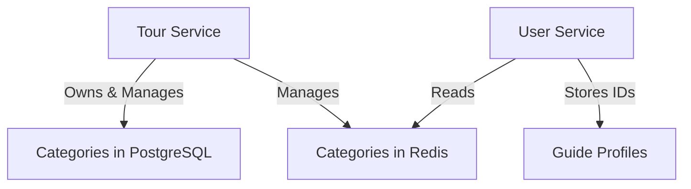

# Category Management Across Microservices

## Status
Accepted

## Context
We need to manage tour categories that are used across multiple microservices:
- Tour service needs categories for tour classification
- User service needs categories for guide profiles
- Initially considered duplicating categories in each service

## Decision
We will:
1. Store categories only in the Tour service (single source of truth)
2. Tour service manages both PostgreSQL and Redis storage
3. User service only reads from Redis
4. Store only category IDs in guide profiles

## Architecture


## Benefits
- Single source of truth (Tour service)
- Clear data ownership
- Simplified cache management
- Better data consistency
- Reduced complexity in User service
- Fast read access for User service

## Implementation Details
1. Tour Service:
   - Manages category CRUD in PostgreSQL
   - Updates Redis cache automatically
   - Handles cache invalidation
   - Provides REST API for direct queries
   - Manages cache warming and updates

2. User Service:
   - Only reads from Redis
   - No write operations to cache
   - Stores category IDs in guide profiles
   - Falls back to Tour service API if cache miss

3. Technologies:
   - PostgreSQL for persistent storage
   - Redis for caching
   - REST APIs for direct queries
   - NestJS for microservices

4. Data Flow:
   ```mermaid
   sequenceDiagram
       participant Admin
       participant Tour
       participant PostgreSQL
       participant Redis
       participant User
       
       Admin->>Tour: Create/Update Category
       Tour->>PostgreSQL: Save Data
       Tour->>Redis: Update Cache
       Note over Tour,Redis: Cache is managed by Tour service
       User->>Redis: Read Categories
       alt Cache Miss
           User->>Tour: Fetch via API
           Tour->>Redis: Warm Cache
           Tour->>User: Return Data
       end
   ```

## Consequences
### Positive
- Clear ownership of data and cache
- Simplified architecture
- Better data consistency
- Reduced complexity in User service
- Single point of cache management
- Clear responsibility boundaries

### Negative
- Tour service has more responsibilities
- Need to handle cache consistency
- Need to implement cache warming strategies
- Need to monitor cache performance

## Technical Implementation
1. Tour Service Cache Management:
   ```typescript
   @Injectable()
   export class CategoryService {
     constructor(
       private readonly em: EntityManager,
       private readonly redis: Redis
     ) {}

     async create(data: CreateCategoryDto) {
       // Save to PostgreSQL
       const category = await this.em.persistAndFlush(new Category(data));
       
       // Update Redis
       await this.updateCache(category);
       
       return category;
     }

     private async updateCache(category: Category) {
       const key = `category:${category.id}`;
       await this.redis.setex(key, 86400, JSON.stringify(category));
     }
   }
   ```

2. User Service Category Access:
   ```typescript
   @Injectable()
   export class GuideService {
     constructor(
       private readonly redis: Redis,
       private readonly httpService: HttpService
     ) {}

     async getCategory(id: string) {
       // Try Redis first
       const cached = await this.redis.get(`category:${id}`);
       if (cached) return JSON.parse(cached);

       // Fallback to API call
       const response = await this.httpService.get(`/categories/${id}`);
       return response.data;
     }
   }
   ```

## Notes
1. Cache Management:
   - Tour service handles all cache operations
   - Implements cache warming strategies
   - Manages cache invalidation
   - Handles cache consistency

2. Error Handling:
   - Implement circuit breakers for Redis
   - Handle cache misses gracefully
   - Provide fallback mechanisms
   - Monitor cache hit rates

3. Monitoring:
   - Track cache hit/miss rates
   - Monitor Redis memory usage
   - Alert on cache inconsistencies
   - Track API fallback frequency 